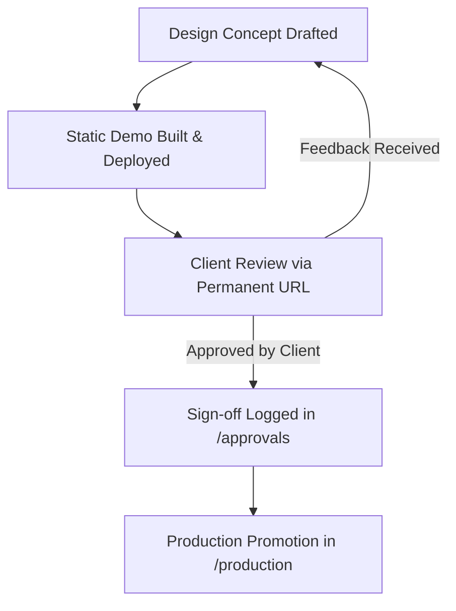

# Shree Ganesha Demo & Approval Portal

This repository hosts the client-facing demo and design approval environment for **Shree Ganesha (Imitation Jewellery Store)**. It acts as the single source of truth for UI discussions, design approvals, and concept validation milestones.

---

## 📌 Project Summary
* **Client Partner:** Shree Ganesha
* **Business Vertical:** Imitation Jewellery Store (Kundan, Temple, CZ Diamond creations)
* **Initial Discussion:** 13 June 2026
* **Demo Creation Date:** 15 June 2026
* **Deployment URL:** `https://<github-owner>.github.io/shreeganesha-demo-portal/`

---

## 📂 Repository Structure

```
shreeganesha-demo-portal/
├── .github/
│   └── workflows/
│       └── deploy.yml          # GitHub Actions CI/CD (Auto Pages Deploy)
├── approvals/
│   └── README.md               # Client sign-offs and feedback history
├── decisions/
│   └── README.md               # Architecture Decision Records (ADRs)
├── production/
│   └── README.md               # Tracking tags promoted to production
├── src/
│   ├── assets/                 # Brand graphics and images
│   ├── components/             # Reusable UI cards and sections
│   ├── config/
│   │   └── constants.js        # Global metadata & WhatsApp checkout number
│   ├── data/
│   │   ├── demos.json          # Portal home dashboard source database
│   │   └── products.json       # Premium jewellery products catalog
│   ├── pages/                  # Page-level components
│   ├── App.jsx                 # Router & State Management
│   ├── main.jsx                # Bootstrap entry point
│   └── index.css               # Emerald & Gold brand design system
├── vite.config.js              # Vite config with base path resolution
├── package.json                # Project dependencies
└── README.md                   # Repository guide (this file)
```

---

## 🔄 Demo & Approval Lifecycle



### 1. Development & Draft
- Prototype views are added under `src/pages/` (e.g. `Demo001.jsx`).
- Metadata is cataloged in `src/data/demos.json` to automatically append cards to the portal home dashboard.

### 2. Live Review
- On every push to the `main` branch, the portal builds and updates the public URL.
- Clients interact with the live storefront, adding jewellery items to the cart, verifying forms, and clicking "Place Order" to verify WhatsApp message formats.

### 3. Client Sign-off
- Once client confirmation is obtained (via email/chat), developer logs the sign-off details under `approvals/` naming the file `YYYY-MM-DD-demo-XXX-approval.md`.

### 4. Promotion Reference
- Tagged releases or package promotions to production environments are tracked in `production/README.md`.

---

## ⚙️ Development & Deployment

### Local Setup
1. Clone the repository and navigate to the project directory:
   ```bash
   cd shreeganesha-demo-portal
   ```
2. Install npm packages:
   ```bash
   npm install
   ```
3. Run the development server locally:
   ```bash
   npm run dev
   ```
4. Access the portal at `http://localhost:5173`.

### Build Verification
Verify clean production compilation before pushing commits:
```bash
npm run build
```

### Automatic Deployment
Pushing to the `main` branch automatically triggers the `.github/workflows/deploy.yml` pipeline:
1. Installs dependencies.
2. Compiles assets to the `/dist` directory.
3. Deploys contents directly to GitHub Pages hosting.
.